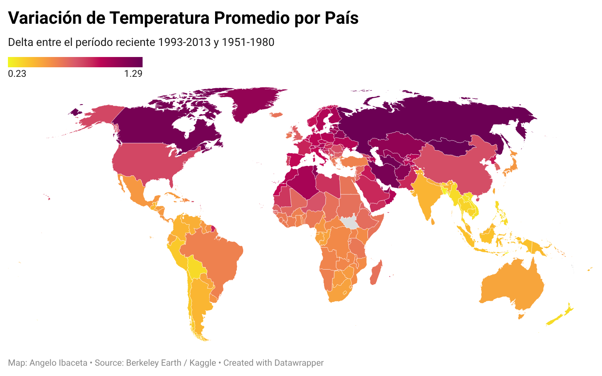

# Informe Tarea 3 — Sección Angelo Ibaceta

## 1. Descripción del Dataset

**Fuente:** Berkeley Earth Surface Temperature Data (disponible en Kaggle)
**Archivo utilizado:** `GlobalLandTemperaturesByCountry_cleaned.csv`
**Limpieza previa:** El dataset fue limpiado en la Tarea 1 (eliminación de registros con `NaN`, exclusión de períodos con incertidumbre superior a la media + 2σ, y descarte de registros anteriores a 1850).

| Atributo                                 | Valor                                                                    |
| ---------------------------------------- | ------------------------------------------------------------------------ |
| Países cubiertos (dataset original)     | 236                                                                      |
| **Países soberanos visualizados** | **195**                                                            |
| Rango temporal                           | 1855 – 2013                                                             |
| Granularidad                             | Mensual por país                                                        |
| Variables                                | `AverageTemperature` (°C), `AverageTemperatureUncertainty` (IC 95%) |

**Descripción cualitativa:**
El dataset registra la temperatura promedio mensual de la superficie terrestre para cada país del mundo, recopilada por Berkeley Earth a partir de múltiples fuentes históricas (NOAA MLOST, NASA GISTEMP, HadCrut). La columna de incertidumbre representa el intervalo de confianza al 95%, siendo mayor en registros históricos lejanos y menor en los más recientes.

**Nota sobre exclusiones:**
El dataset original incluye 41 **territorios dependientes y entidades no soberanas** (como Guadalupe, Aruba, Puerto Rico, Islas Vírgenes, Islas Malvinas, Polinesia Francesa, entre otros) que fueron excluidos de la visualización. El mapa base de Datawrapper utiliza como unidad geográfica la **nación soberana reconocida internacionalmente**, por lo que dichos territorios — que no poseen representación cartográfica independiente en ningún mapa mundial estándar — no pueden ser mapeados individualmente. Esta exclusión es coherente con el enfoque del análisis, que busca comparar países como unidades políticas con capacidad de adoptar políticas climáticas propias.

**Procesamiento específico para T3:**Se calculó la temperatura promedio para dos períodos:

- **Línea base (baseline):** 1951–1980 (estándar climatológico NASA/GISS)
- **Período reciente:** 1993–2013

Para cada país se calculó el **delta de calentamiento** = `temp_reciente - temp_baseline`. Solo se incluyeron países con al menos 20 años de datos en el baseline y 15 años en el período reciente.

---

## 2. Objetivo de la Visualización

**Pregunta que responde:**
¿Cómo se distribuye geográficamente el calentamiento climático entre los países del mundo? ¿Qué tan desigual es el fenómeno, y dónde se ubica Chile en ese contexto global?

**Público objetivo:**
Ciudadanos, estudiantes universitarios y tomadores de decisiones ambientales que necesitan evidencia visual clara sobre la distribución espacial del calentamiento global.

**Acción o decisión que apoya:**
Permite identificar qué regiones del mundo han experimentado el mayor calentamiento en las últimas décadas, apoyando la priorización de políticas de adaptación climática, inversión en infraestructura resiliente y acuerdos internacionales focalizados.

---

## 3. Tipo de Mapa y Justificación

**Tipo:** Mapa Coroplético (Choropleth Map)
**Herramienta:** Datawrapper

**Justificación del tipo de mapa:**El mapa coroplético es el tipo más adecuado para esta visualización porque:

- El dato a mostrar (delta de temperatura) es una **variable numérica continua** asignada a **unidades geográficas discretas** (países), que es exactamente el caso de uso para el que fue diseñado el coropleta.
- Permite **comparar magnitudes entre países de forma inmediata** a través del color, sin necesidad de leer valores individuales.
- A diferencia de un mapa de puntos (que requiere coordenadas precisas de ubicaciones), el coropleta **abarca la totalidad del territorio** de cada país, siendo más apropiado para una variable que describe una condición a nivel nacional.

---

## 4. Esquemática Utilizada

- **Tipo de esquema:** Descripción geográfica con comparación temporal implícita
- La variable visualizada (delta de temperatura) condensa dos dimensiones temporales (baseline vs reciente) en un único valor numérico, permitiendo que el mapa muestre el **resultado acumulado del calentamiento** sin necesidad de una animación o slider temporal.
- **Narrativa visual:** El gradiente de color guía al ojo desde las zonas de menor cambio (azul/blanco) hacia las zonas de mayor calentamiento (rojo), revelando patrones geográficos estructurales del fenómeno climático.

---

## 5. Colores y Justificación

| Rango de Valor      | Color                     | Significado                                     |
| ------------------- | ------------------------- | ----------------------------------------------- |
| ~ 0.23°C (Mínimo) | Amarillo brillante        | Calentamiento leve (menor magnitud observada)   |
| ~ 0.65°C (Centro)  | Naranja / Rojo claro      | Calentamiento moderado (promedio global)        |
| ~ 1.29°C (Máximo) | Púrpura oscuro / Magenta | Calentamiento severo (mayor magnitud observada) |
| Sin datos           | Gris medio                | Datos insuficientes o territorios no mapeados   |

**Justificación:**Dado que el análisis demostró que **todos los países experimentaron un aumento de temperatura** (el valor mínimo es > 0), se optó por una **escala secuencial cálida (Amarillo → Naranja → Púrpura oscuro)** en lugar de una divergente clásica (azul-blanco-rojo) que sugeriría zonas de enfriamiento inexistentes en este período.

- **Precisión semántica:** La escala secuencial comunica visualmente que el fenómeno va en una sola dirección (aumento de temperatura), utilizando colores más oscuros y saturados para representar las mayores magnitudes.
- **Intuitividad térmica:** La progresión desde amarillo (cálido) hacia el púrpura profundo ("calor extremo") es una metáfora visual muy efectiva para el calentamiento global.
- **Accesibilidad cromática:** Este tipo de gradiente continuo tiene una variación progresiva de luminosidad clara a oscura, lo que facilita enormemente la lectura a personas con daltonismo y mantiene su legibilidad incluso en escala de grises.

---

## 6. Tipografía

- **Fuente:** Roboto (tipografía predeterminada de Datawrapper)
- Sans-serif, alta legibilidad en pantalla, moderna y neutra
- Se coordinó con el equipo para mantener coherencia tipográfica en la infografía grupal

---

## 7. Conclusiones

A partir del mapa coroplético generado con los datos de Berkeley Earth (1951–2013):

### Hallazgos globales

- **Ningún país del mundo registró enfriamiento** en el período analizado: todos los 236 países con datos suficientes muestran un delta positivo (calentamiento).
- El **delta promedio global fue de +0.690°C**, con una distribución que va desde +0.229°C (Timor Leste, menor cambio) hasta +1.293°C (Mongolia, mayor cambio).
- La distribución por categorías revela que:
  - **159 países** (67%) experimentaron calentamiento moderado (+0.5°C a +1.0°C)
  - **49 países** (21%) experimentaron calentamiento leve (< +0.5°C)
  - **28 países** (12%) experimentaron calentamiento significativo (> +1.0°C)

### Patrones geográficos

- Los países con **mayor calentamiento** se concentran en **latitudes altas del hemisferio norte**: Mongolia (+1.293°C), Rusia (+1.281°C), Turkmenistán (+1.254°C), Canadá (+1.233°C), Irán (+1.228°C).
- Los países con **menor calentamiento** son mayoritariamente países de **Asia sudoriental tropical**: Vietnam (+0.298°C), Hong Kong (+0.251°C), Bangladesh (+0.249°C), Macao (+0.236°C), Timor Leste (+0.229°C).
- Esto confirma el fenómeno conocido como **"Arctic Amplification"**: las regiones de mayor latitud se calientan más rápido que las zonas ecuatoriales.

### Chile en contexto global

- Chile registró un delta de **+0.374°C**, ubicándose en la categoría de **calentamiento leve**.
- Su temperatura promedio pasó de **9.581°C** (1951-1980) a **9.955°C** (1993-2013).
- Chile ocupa el **ranking #222 de 236** países (siendo #1 el de mayor calentamiento), es decir, está entre el **6% de países con menor calentamiento observado**.
- Esto se explica por su posición geográfica: la influencia de la corriente de Humboldt en la costa y su latitud sudamericana actúan como reguladores térmicos que amortiguan el calentamiento.

### Conclusión principal

El calentamiento global no es un fenómeno uniforme: existe una **marcada desigualdad geográfica** donde las naciones de latitudes altas (que históricamente han emitido más CO₂) sufren el mayor calentamiento, mientras que países tropicales y del hemisferio sur (generalmente menores emisores) experimentan cambios más moderados. Esta asimetría tiene implicaciones directas para la **justicia climática** y la distribución de responsabilidades en la adaptación al cambio climático.

---

## 8. Visualización Final

## 9. Fuente de Datos

Berkeley Earth Surface Temperature Data (2013). *GlobalLandTemperaturesByCountry*. Disponible en: https://www.kaggle.com/datasets/berkeleyearth/climate-change-earth-surface-temperature-data
